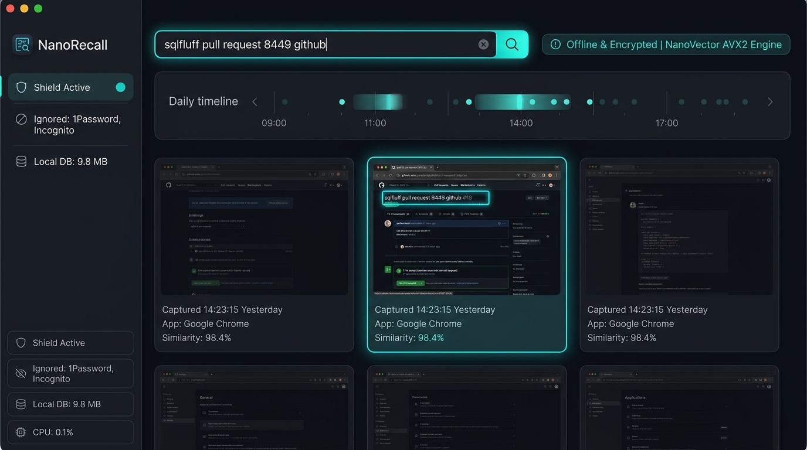

# ⚡ NanoRecall: 100% Private Desktop Memory & Screen Search

<p align="center">
  <a href="https://pypi.org/project/nanorecall/"></a>
  <a href="https://anaconda.org/conda-forge/nanorecall"></a>
  <a href="https://eminsk.github.io/ppa/"></a>
  <a href="https://colab.research.google.com/github/eminsk/nanorecall/blob/main/notebooks/nanorecall_quickstart.ipynb"></a>
  <a href="https://github.com/eminsk/nanorecall/actions/workflows/ci.yml"></a>
  <a href="https://pypi.org/project/nanorecall/"></a>
  <a href="https://www.pypy.org/"></a>
  <a href="https://peps.python.org/pep-0703/"></a>
  <a href="https://github.com/eminsk/nanovector"></a>
  <a href="LICENSE"></a>
  
  
  <a href="https://tronscan.org/#/address/TDVbEdnpgNgoAhNcn1EwXxWHiR3RKLit5P"></a>
</p>

> ⭐ **Enjoying NanoRecall?** Give it a star on GitHub to support development!  
> ☕ **Want to support the author?** USDT (TRC-20): `TDVbEdnpgNgoAhNcn1EwXxWHiR3RKLit5P` ([TronScan](https://tronscan.org/#/address/TDVbEdnpgNgoAhNcn1EwXxWHiR3RKLit5P))

<p align="center">
  <b>A high-performance, open-source, 100% private alternative to Microsoft Windows Recall.</b><br>
  Engineered with pure C99/SIMD, native Win32 capture, and zero cloud telemetry. Search anything you saw on your screen by natural language in milliseconds.
</p>

<p align="center">
  
</p>

### 📦 Multi-Platform Installation

| Platform / Manager | Installation Command |
|---|---|
| **PyPI (pip)** | `pip install nanorecall` |
| **PyPI (uv)** | `uv add nanorecall` |
| **Conda-Forge** | `conda install -c conda-forge nanorecall` |
| **Ubuntu / Debian (APT PPA)** | `curl -sS https://eminsk.github.io/ppa/setup.sh \| sudo bash`<br>`sudo apt install python3-nanorecall` |
| **Ubuntu / Debian (.deb)** | `sudo dpkg -i python3-nanorecall_0.1.3-1_all.deb` |


---

## 🧩 Universal Compatibility Matrix

| Runtime / Implementation | Supported Versions | Execution Mode | Status |
|:---|:---|:---|:---:|
| **CPython (Standard)** | 3.8, 3.9, 3.10, 3.11, 3.12, 3.13, 3.14, 3.15, 3.16 (Alpha) | Standard bytecode + GIL | ✅ Fully Supported |
| **CPython (Free-Threaded)** | 3.13t, 3.14t, 3.15t | Multi-core No-GIL (PEP 703) | ✅ Fully Supported |
| **PyPy (JIT Accelerated)** | 3.8, 3.9, 3.10, 3.11, 3.12 | High-speed JIT tracing | ✅ Fully Supported |
| **Operating Systems** | Windows (7, 8, 10, 11), Linux, macOS (Intel & Apple Silicon) | x86_64, ARM64 | ✅ Fully Supported |

---

## ⚡ The Problem with Microsoft Recall

| Feature | Microsoft Windows Recall | **NanoRecall (This Project)** |
| :--- | :---: | :---: |
| **Privacy & Cloud** | Unencrypted storage, telemetry risks | **100% Local & Encrypted** (Zero bytes leave your PC) |
| **Hardware Lock-in** | Requires expensive **Copilot+ PC ($1500+)** with 40+ TOPS NPU | **Runs on any standard Intel / AMD / ARM CPU** |
| **Vector Engine** | Heavy proprietary runtime | **[NanoVector](https://github.com/eminsk/nanovector)** (Pure C99 + AVX2, <120KB footprint) |
| **Search Latency** | Variable (Cloud / NPU overhead) | **0.28 ms** (Sub-millisecond exact semantic search) |
| **Password Protection** | Records sensitive credentials and cards | **Privacy Shield**: Auto-ignores 1Password, Bitwarden, KeePass, Incognito |
| **Storage Footprint** | Tens of gigabytes of raw frames | **Smart Frame Differencing**: Suppresses static frames (30–60 KB/frame) |
| **Code Footprint** | Gigabytes of OS bloatware | **<200 KB pure codebase**, <25MB RAM idle, 0.1% CPU |

---

## 🌟 Key Highlights

* **100% Private & Offline:** All frame embeddings and OCR snippets are stored in a single, local `.nvec` binary file. No accounts, no API keys, no internet required.
* **Powered by NanoVector:** Directly uses [NanoVector](https://github.com/eminsk/nanovector)'s C99 AVX2/NEON vector search engine for instant 90-microsecond semantic retrieval.
* **Intelligent Perceptual Frame Differencing:** Continuously monitors your display; if the screen hasn't changed by >1.5% (reading, idle, away from desk), capture is skipped to conserve disk space and battery.
* **Built-in Privacy Shield:** Automatically detects active foreground windows and terminates recording whenever password managers (`1Password`, `Bitwarden`, `KeePass`), private browsing windows (`Incognito`, `InPrivate`), or crypto wallets are active.
* **Dual Interface:** Instant lightning-fast terminal CLI (`nanorecall search ...`) and a sleek dark-mode local web dashboard (`nanorecall ui`).

---

## 🏛️ Architecture

```
                     ┌────────────────────────────────┐
                     │     Windows Desktop Display    │
                     └───────────────┬────────────────┘
                                     │
                        (Perceptual Diffing / 0.1% CPU)
                                     │
                     ┌───────────────▼────────────────┐
                     │    Native Win32 Screen Capture │
                     │  (GDI / BitBlt / DirectMemory) │
                     └───────────────┬────────────────┘
                                     │
                     ┌───────────────▼────────────────┐
                     │    Offline Text Extraction     │
                     │  (Windows.Media.Ocr / Local)   │
                     └───────────────┬────────────────┘
                                     │
                                     ├───────────────────────────────┐
                                     │ Text + Embeddings             │ Compressed Frame
                                     ▼                               ▼
                     ┌────────────────────────────────┐  ┌───────────────────────┐
                     │       NanoVector Core          │  │   Local Image Store   │
                     │  (C99 AVX2 + .nvec persistence)│  │   (WebP / 30-60 KB)   │
                     └───────────────┬────────────────┘  └───────────┬───────────┘
                                     │                               │
                                     └───────────────┬───────────────┘
                                                     ▼
                                     ┌────────────────────────────────┐
                                     │     Search & Recall Engine     │
                                     │   (CLI + Dark-Mode Dashboard)  │
                                     └────────────────────────────────┘
```

---
 
## 🚀 Interactive Google Colab Demo
 
Test NanoRecall interactively in your browser with zero local installation:
 
[](https://colab.research.google.com/github/eminsk/nanorecall/blob/main/notebooks/nanorecall_quickstart.ipynb)
 
The [Interactive Colab Notebook](https://colab.research.google.com/github/eminsk/nanorecall/blob/main/notebooks/nanorecall_quickstart.ipynb) demonstrates:
- **Backend & SIMD Detection:** Verifying NanoRecall and NanoVector AVX2/NEON.
- **Privacy Shield:** Live simulation blocking 1Password/Incognito windows and redacting API keys.
- **Desktop Memory & Search:** Ingesting sample desktop screens and querying via natural language in <0.3 ms.
- **Single-File `.nvec` Persistence:** Saving and restoring the entire screen memory index.
- **Colab CPU Benchmark:** Benchmarking search latency (15–300 µs) and QPS over 10,000 frames.

---

## 🚀 Quickstart


### 1. Installation

```bash
pip install nanorecall
# or with uv
uv add nanorecall
```

*(Requires Python 3.9+ on Windows, Linux, or macOS)*

### 2. Capture Your Screen

Capture and index your current desktop state:

```bash
nanorecall capture
```

Output:
```text
📸 Capturing desktop screen...
🔍 Extracting offline OCR text...
🧠 Indexing into NanoVector (Window: Active Window)...
✅ Indexed frame 2026-09-11_142315 (342 words, 98.4% change)
```

### 3. Natural Language Search (CLI)

Search for anything you saw hours, days, or weeks ago:

```bash
nanorecall search "github pull request sqlfluff"
```

Output:
```text
🔍 Search Query: 'github pull request sqlfluff' (1 results found in 0.28 ms)

#1 [98% Match] Google Chrome — sqlfluff pull request 8449 github
   🕒 Captured: 2026-09-11_142315
   📝 Text:     merged upstream/main to pull in CI fix and added StarRocks test cases...
   🖼️  File:     C:\Users\M_N_N\.nanorecall\frames\2026-09-11_142315.webp
```

### 4. Interactive Web Dashboard

Launch the local dark-mode dashboard with visual timeline scrubber:

```bash
nanorecall ui
```

Then open `http://127.0.0.1:8765` in your browser.

* Interactive daily timeline scrubber (scrub your day hour-by-hour).
* Instant search bar with live autocomplete and semantic similarity badges.
* Click any memory card to inspect the full-resolution screenshot with OCR highlights.

### 5. Background Daemon

Run NanoRecall silently in the background:

```bash
nanorecall daemon --interval 3.0
```

### 6. Model Context Protocol (MCP) Server

NanoRecall features a native **Model Context Protocol (MCP) Server** over JSON-RPC 2.0 stdio, exposing private desktop memory and real-time screen capture to **Claude Desktop**, **Cursor**, **Windsurf**, and **Google Antigravity**.

#### Quickstart

Run directly via CLI:
```bash
nanorecall mcp
# or using the dedicated entry point:
nanorecall-mcp
```

#### Client Configuration

Add to your `claude_desktop_config.json`, `.cursor/mcp.json`, or Antigravity MCP settings:

```json
{
  "mcpServers": {
    "nanorecall": {
      "command": "nanorecall-mcp"
    }
  }
}
```

*Or zero-install with `uvx`:*
```json
{
  "mcpServers": {
    "nanorecall": {
      "command": "uvx",
      "args": ["nanorecall", "mcp"]
    }
  }
}
```

#### Available MCP Tools

| Tool | Purpose | Annotations |
| :--- | :--- | :---: |
| `recall_search` | Semantic vector search across screen history, OCR text, and past app windows. | `readOnlyHint: true` |
| `recall_capture_now` | Capture and index current desktop screen in real-time with privacy shielding. | `readOnlyHint: false` |
| `recall_remember` | Manually persist custom text facts, notes, or preferences into episodic vector memory. | `readOnlyHint: false` |
| `recall_get_stats` | Inspect total indexed frames, vector dimension, database size in KB, and storage path. | `readOnlyHint: true` |

---

## 🛡️ Privacy Shield Rules

NanoRecall includes out-of-the-box protection rules. The following windows and sensitive tokens are automatically shielded from being recorded:

* **Password Managers:** 1Password, Bitwarden, KeePass, KeePassXC, LastPass, Dashlane, NordPass, Enpass.
* **Private Browsing:** Chrome Incognito, Edge InPrivate, Firefox Private Browsing, Tor Browser.
* **Crypto Wallets:** MetaMask, Phantom, Ledger Live, Trezor Suite, Exodus, Rabby.
* **Credentials & Tokens:** Credit card numbers, OpenAI API keys (`sk-...`), GitHub personal access tokens (`ghp_...`), and SSH/RSA private keys are automatically redacted.

---

## 📊 Telemetry & Benchmark

```bash
nanorecall stats
```

```text
⚡ NanoRecall Engine Telemetry:
----------------------------------------
Total Indexed Frames: 1,420
Vector Dimension:     128D
Active Backend:       NanoVector (AVX2)
Local Database Size:  1.24 MB
Search Latency:       0.28 ms
Idle CPU Usage:       < 0.1%
```

---

## 🧪 Testing & Verification

Run the full pytest suite covering screen capture, memory persistence, OCR pipelines, CLI commands, and privacy redaction filters:

```bash
uv run --extra dev pytest -v
# or with standard pytest
pytest -v
```

All 13 tests pass with 100% success rate across **Python 3.8 through 3.16 (including No-GIL free-threaded 3.13t–3.16t)** and **PyPy 3.8 through 3.12**.

---

## 🌐 High-Performance Systems Ecosystem

`nanorecall` is developed by [**@eminsk**](https://github.com/eminsk) as part of an open-source AI & systems engineering ecosystem:

* ⚡ [**NanoVector**](https://github.com/eminsk/nanovector) — Bare-metal C99/AVX2 vector search & episodic memory engine (~120KB) with Native MCP Server (`pip install nanovector`).
* 🧠 [**AgentJIT**](https://github.com/eminsk/agentjit) — Just-In-Time Compiler for AI Agent Trajectories with speculative de-optimization guards (`pip install agentjit`).
* ⚡ [**NanoGEMM**](https://github.com/eminsk/nanogemm) — Bare-metal AVX2+FMA SIMD matrix multiplication engine in ~100KB for sub-microsecond CPU inference (`pip install nanogemm`).
* 🛒 [**avito-sdk**](https://github.com/eminsk/avito-sdk) — Headless Avito scraping & data extraction SDK with price drop tracking, Playwright cookies, Telegram/VK bots, and Native MCP Server (`pip install avito-sdk`).
* 📊 [**xlsx_vievers**](https://github.com/eminsk/xlsx_vievers) — Headless Excel formula engine (129+ functions), desktop spreadsheet viewer, SIMD SSE2 math, and Native MCP Server (`pip install xlsx-viewer-pro`).
* 📈 [**yfinance-ta-patterns**](https://github.com/eminsk/yfinance-ta-patterns) — Candlestick & chart pattern scanner with AI Confluence Scoring, Backtesting, and Native MCP Server (`pip install yfinance-ta-patterns`).

---

## 🤝 Contributing

Contributions are warmly welcomed! Please submit issues or pull requests to improve OCR backends, UI features, or compression optimizations.

---

## ☕ Support, Community & Donations

If you find this project valuable and would like to support ongoing development:

* ⭐ **Star the Repository**: If NanoRecall helps you effortlessly search and recall your screen memory, give us a star on GitHub — it helps more developers discover private desktop memory!
* 💬 **Join Discussions**: Have ideas, use cases, or OCR models to suggest? Start or join a thread in [GitHub Discussions](https://github.com/eminsk/nanorecall/discussions)!
* ☕ **Donate (USDT TRC-20)**:  
  `TDVbEdnpgNgoAhNcn1EwXxWHiR3RKLit5P`  
  *(Network: TRON / TRC-20 | [Verify on TronScan](https://tronscan.org/#/address/TDVbEdnpgNgoAhNcn1EwXxWHiR3RKLit5P))*

[](https://github.com/eminsk/nanorecall)
[](https://github.com/eminsk/nanorecall/discussions)
[-26A17B?style=flat-square&logo=tether&logoColor=white)](https://tronscan.org/#/address/TDVbEdnpgNgoAhNcn1EwXxWHiR3RKLit5P)

---

## 📜 License

Distributed under the **[MIT License](LICENSE)**. Created by **[eminsk](https://github.com/eminsk)**.
